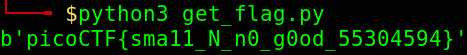

## Mind your Ps and Qs

## Description
In RSA, a small `e` value can be problematic, but what about `N`? Can you decrypt this?
[values](./values)

## How To 
We are given a small `N` which means we will be able to find `p` and `q` easily. Luckily in our case the `N` is fully factored on [factordb](http://factordb.com/). 
If we plug `N` into factordb we will get  
p = `1461849912200000206276283741896701133693`  
q = `431899300006243611356963607089521499045809`  
With the information given to us in values, `c`, `e` and `N` we are able to solve this with a simple [script](./get_flag.py). 
For a more in-depth explanation of the script, this John Hammond [video](https://www.youtube.com/watch?v=_lg2AEqRTjg&t=211s) of a similar challenge explains it.  
The only thing I changed from his script was the last line, to `print(decode(hex(m1)[2:],'hex'))` since in his tutorial he is using python2.

## Flag

