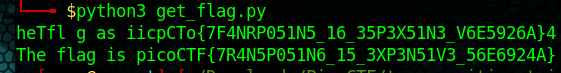

# transposition-trial

## Description
Our data got corrupted on the way here. Luckily, nothing got replaced, but every block of 3 got scrambled around! The first word seems to be three letters long, maybe you can use that to recover the rest of the message.
Download the corrupted message [here](./message.txt). 

## Hints
Split the message up into blocks of 3 and see how the first block is scrambled

## How To

After analyzing the cipher, it should come clear to you that if you break the message into blocks of 3, and for each block all you need to do is 
move the last letter to the front of the block. So 'bca' would uncipher to 'abc'. You could do this by hand, but I decided to write a [script](./get_flag.py) to solve this for us.

## Flag

