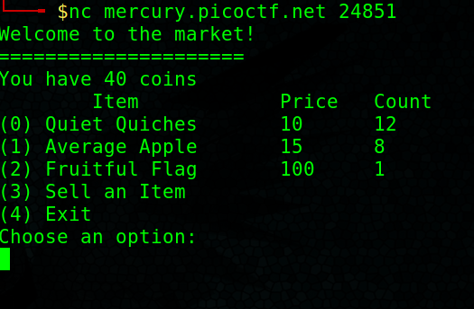
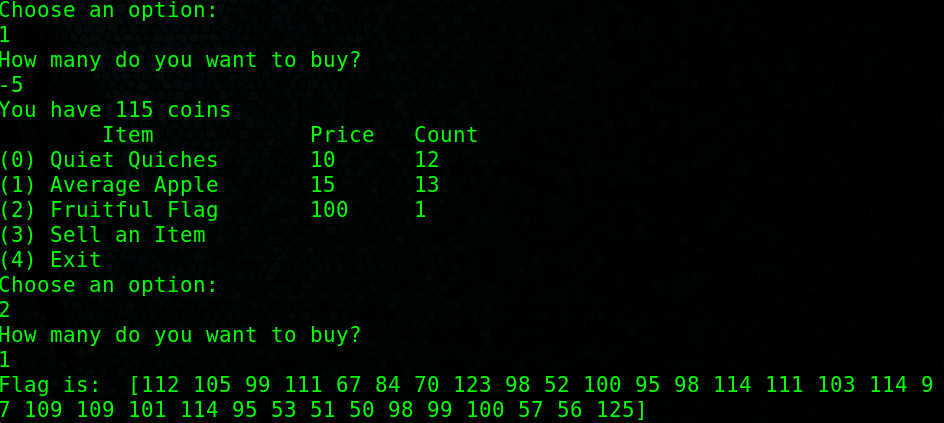
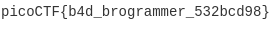

## Shop

## Description
Best Stuff - Cheap Stuff, Buy Buy Buy... Store Instance:  
[source](./source). The shop is open for business at `nc mercury.picoctf.net 24851`.

## Hints
Always check edge cases when programming.

## How To
Once we run the command in a new terminal `nc mercury.picoctf.net 24851`  
We will recieve the following results.  
  
You can play around with the shop and buy/sell quiet quiches and average apples, and you'll see flags cost 100.  
If you try a negative number when purchasing either average apples or quiet quiches, you will notice there is no error checking, this allows us to buy more than our allowance  
and buy a fruitful flag. 
In the below screenshot you can see me navigate the prompts to buy a flag.
  
The flag is in decimal number so we can use [cyberchef](https://gchq.github.io/CyberChef/) to convert from decimal to ascii.

