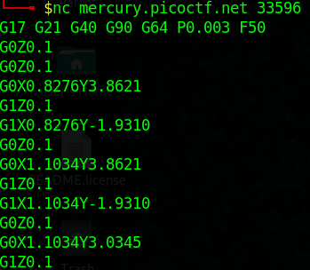
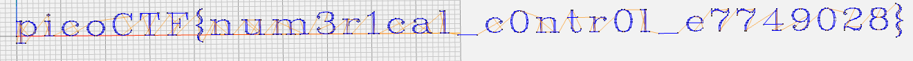

# speeds and feeds

## Description
There is something on my shop network running at
`nc mercury.picoctf.net 33596`, but I can't tell what it is. Can you?

## Hints
What language does a CNC machine use?

## How To
First thing we want to do is run the command given to us, `nc mercury.picoctf.net 33596` once we run this command you can see the output is roughly around 1,000 lines of code.
You can either copy the output or send the output to a file, either method will work for now

If we research what code CNC machines use, we will find that they use G-Code. To learn more about G-Code read this [blog](https://www.steckermachine.com/blog/g-code-and-m-code-programming).
Now that we know what G-Code is, we want to look for a [visualizer](https://ncviewer.com/), this website allows either pasted text or a file to be visualized from G-Code.
Once you paste your text or drop your file, you should receive the following visualization giving you the flag.

