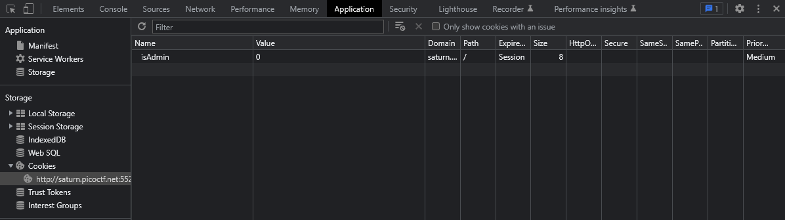
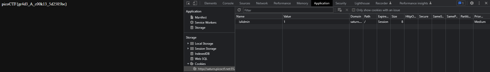

## Power Cookie

## Description
Can you get the flag?
Go to this [website](http://saturn.picoctf.net:55287/) and see what you can discover.

## Hints
Do you know how to modify cookies?

## How to
Wehn we follow the link, we're prompted with a very basic website, and using the hint,  
the first thing we want to look at is the cookies. You'll notice that there are no cookies saved initially.  
If you click "*continue as guest*" and then you'll see a new cookie `isAdmin` set to 0.  
  
Set this cookies value to `1` and refresh the page to return the flag.

## Flag
`picoCTF{gr4d3_A_c00k13_5d2505be}`  

