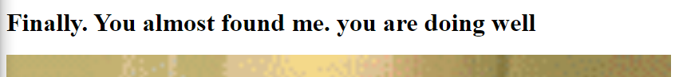
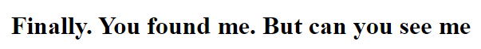

## Secrets

## Description 
We have several pages hidden. Can you find the one with the flag? <br>
The website is running [here](http://saturn.picoctf.net:61481/)

## Hints 
folders folders folders

## How To
If we follow the link to the website, the first thing we want to do is view the source code of the main page. <br>
```html
<!DOCTYPE html>
<html>
  <head>
    <meta charset="UTF-8" />
    <meta
      name="viewport"
      content="width=device-width, initial-scale=1, shrink-to-fit=no"
    />
    <meta name="description" content="" />
    <!-- Bootstrap core CSS -->
    <link href="vendor/bootstrap/css/bootstrap.min.css" rel="stylesheet" />
    <!-- title -->
    <title>home</title>
    <!-- css -->
    <link href="secret/assets/index.css" rel="stylesheet" />
  </head>
  <body>
    <!-- ***** Header Area Start ***** -->
    <div class="topnav">
      <a class="active" href="#home">Home</a>
      <a href="about.html">About</a>
      <a href="contact.html">Contact</a>
    </div>

    <div class="imgcontainer">
      
      <div class="top-left">
        <h1>If security wasn't your job, would you do it as a hobby?</h1>
      </div>
    </div>
  </body>
</html>
```
You will see some of the assets are stored in `secret/assets/`. If we take this clue and navigate to <br>
`http://saturn.picoctf.net:61481/secret/` this pulls up the following page: <br>
 <br>

```html
<!DOCTYPE html>
<html>
  <head>
    <title></title>
    <link rel="stylesheet" href="hidden/file.css" />
  </head>

  <body>
    <h1>Finally. You almost found me. you are doing well</h1>
    
  </body>
</html>
```
In the source code for this page, we can see another key folder, `/hidden/` if we navigate to `http://saturn.picoctf.net:61481/secret/hidden/` <br>
It yields a similar clue to the two previous steps, `/superhidden/`, so we want to navigate to `http://saturn.picoctf.net:61481/secret/hidden/superhidden` <br>
This yields the website and one we view the source code we should be see the flag.


## Flag 
picoCTF{succ3ss_@h3n1c@10n_39849bcf}
