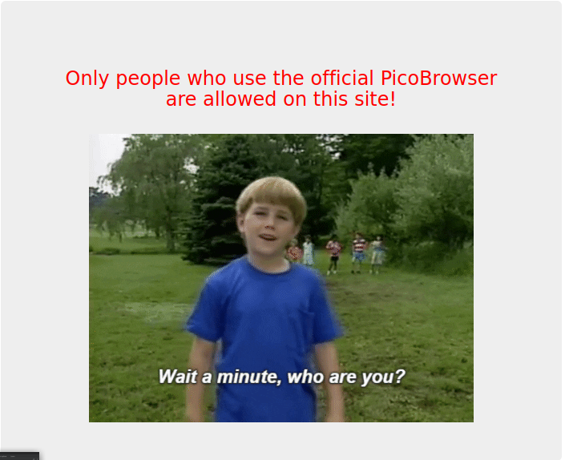
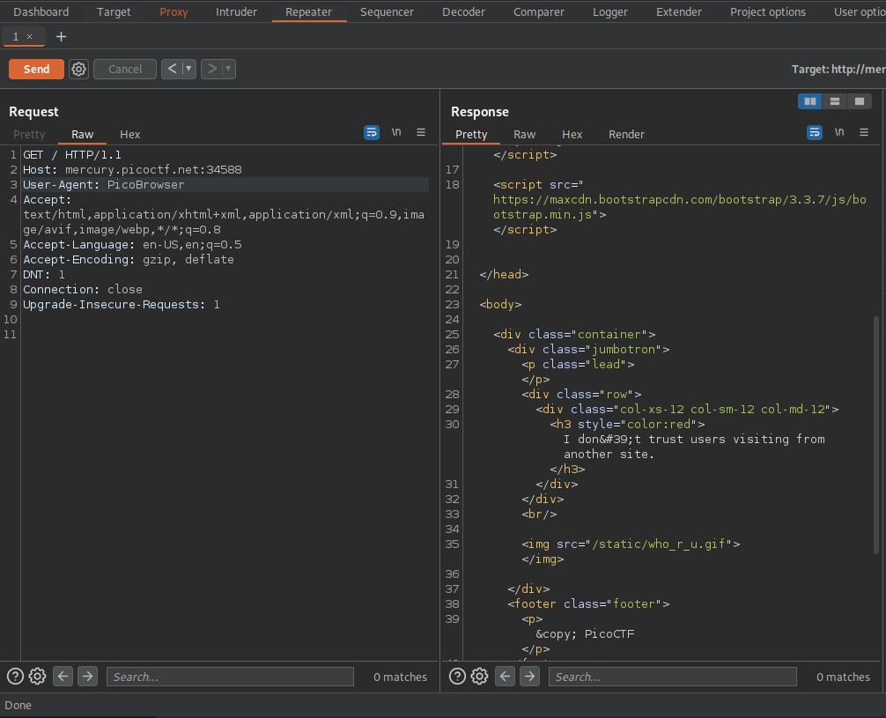
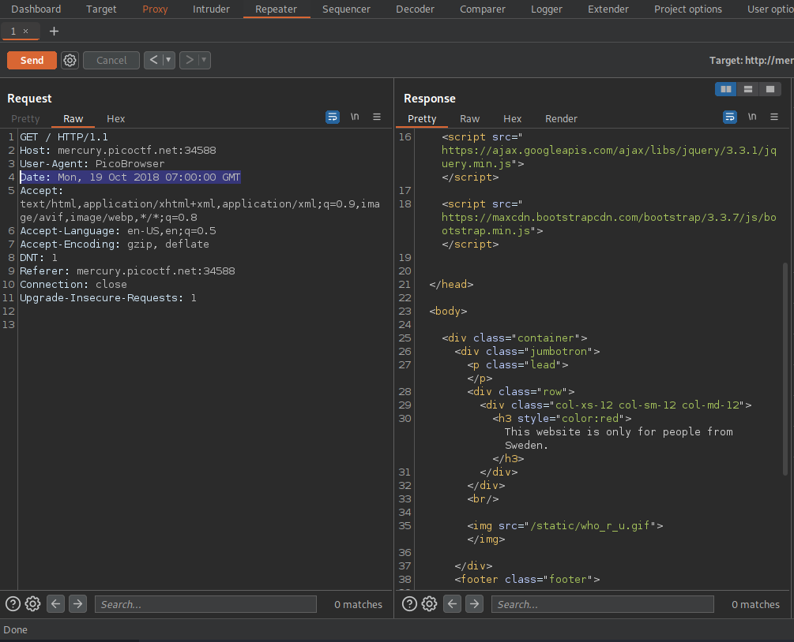
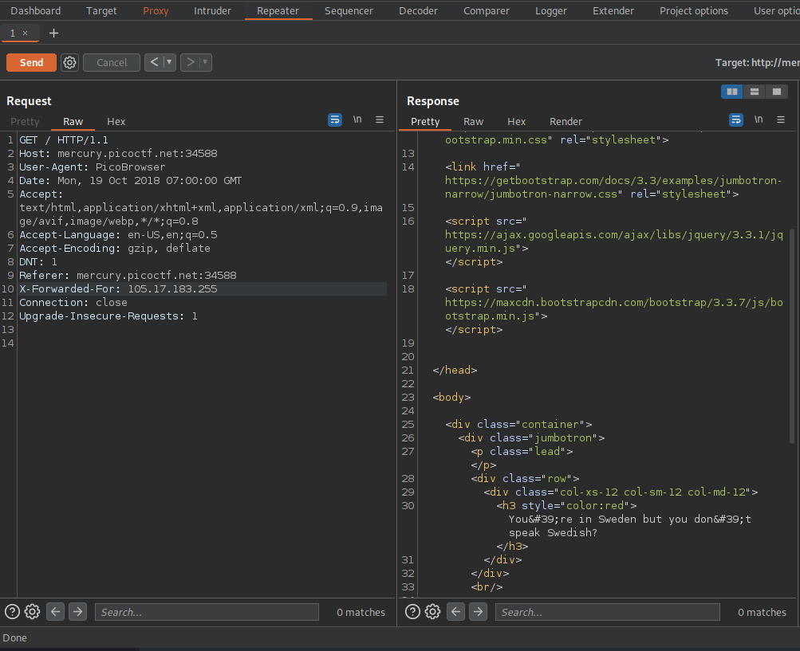
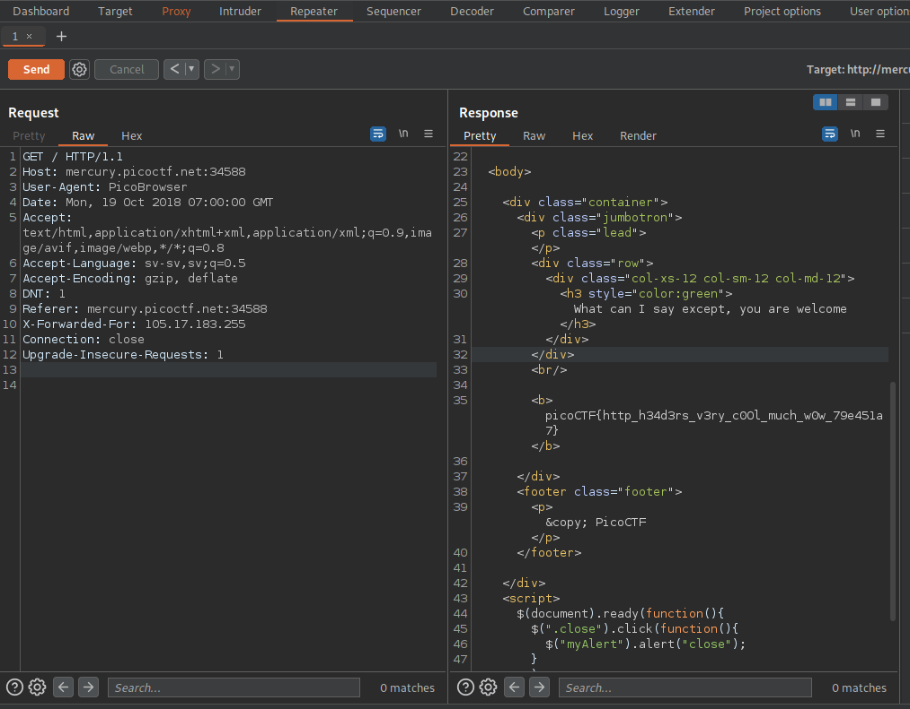
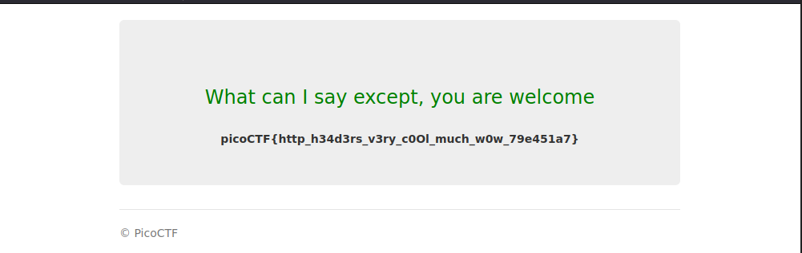

## Who are you?

## Description
Let me in. Let me iiiiiiinnnnnnnnnnnnnnnnnnnn  
[http://mercury.picoctf.net:34588/](http://mercury.picoctf.net:34588/)

## Hints 
It ain't much, but it's an RFC [https://tools.ietf.org/html/rfc2616](https://tools.ietf.org/html/rfc2616)  

## How To
Navigate to the site [https://tools.ietf.org/html/rfc2616](https://tools.ietf.org/html/rfc2616)  
Will be prompted with the following webpage.  

  

This gives a clue that it needs to be accessed through `PicoBrowser`.  
Next intercept a get request navigating to the main page in burp,  
in the request replace the current User-Agent with `PicoBrowser`.  

  

The response indicates that it doesn't trust users visiting from other sites.  
This is another clue relating to the `Referer`, in order to fool the site,  
set the Referer header to the host, in my case `Referrer: mercury.picoctf.net:34588`.  

  

In the response, is another clue, the site only worked in 2018.  
This clue is relating to the date header and it must be set to a date in 2018.  
I used the following date, `Date: Mon, 19 Oct 2018 07:00:00 GMT`  

  

In the response comes another clue, website is only for people from Sweden.  
This clue relates to the `X-Forwarded-For` header.  
For more info these are two great documentation links describing the header  
[https://www.geeksforgeeks.org/http-headers-x-forwarded-for/](https://www.geeksforgeeks.org/http-headers-x-forwarded-for/)  
[https://developer.mozilla.org/en-US/docs/Web/HTTP/Headers/X-Forwarded-For](https://developer.mozilla.org/en-US/docs/Web/HTTP/Headers/X-Forwarded-For)  
I used `105.17.183.255` for my swedish IP address, was found using simple google search.  

  

In the response is the final clue, and that is we don't speak Swedish,  
this relates to the `Accept-language` header already in the requests.  
Replace `en-US,en;q=0.5` with `sv-sv,sv;q=0.5`.  
The response will reveal the flag.  

  
  

## Flag
`picoCTF{http_h34d3rs_v3ry_c0Ol_much_w0w_79e451a7}`

