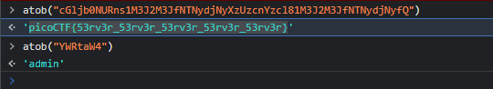

## login

## Description
My dog-sitter's brother made this website but I can't get in; can you help? <br>
[https://login.mars.picoctf.net/](https://login.mars.picoctf.net/)

## Hints
(None)

# How to
When we follow the link given to us in the description, we are taken to a very basic login prompt.
If we open the pages source code we get: 
```html
<!doctype html>
<html>
    <head>
        <link rel="stylesheet" href="styles.css">
        <script src="index.js"></script>
    </head>
    <body>
        <div>
          <h1>Login</h1>
          <form method="POST">
            <label for="username">Username</label>
            <input name="username" type="text"/>
            <label for="username">Password</label>
            <input name="password" type="password"/>
            <input type="submit" value="Submit"/>
          </form>
        </div>
    </body>
</html>
```
We don't get much information from this file but we can see `index.js` linked in the header, if we add `index.js` to the URL we get:
```js
(async()=>{await new Promise((e=>window.addEventListener("load",e))),document.querySelector("form").addEventListener("submit",(e=>{e.preventDefault();const r=
{u:"input[name=username]",p:"input[name=password]"},t={};for(const e in r)t[e]=btoa(document.querySelector(r[e]).value).replace(/=/g,"");return"YWRtaW4"!==t.u?alert("Incorrect
Username"):"cGljb0NURns1M3J2M3JfNTNydjNyXzUzcnYzcl81M3J2M3JfNTNydjNyfQ"!==t.p?alert("Incorrect Password"):void alert(`Correct Password! Your flag is ${atob(t.p)}.`)}))})();
```
This file is intentionally made sloppy to throw us off.
```js
(async()=>{
  await new Promise((e=>window.addEventListener("load",e))),
  document.querySelector("form").addEventListener("submit",(e=>{
    e.preventDefault();
    const r = {
            u: "input[name=username]",
            p: "input[name=password]"
        }
         , t = {};
        for (const e in r)
            t[e] = btoa(document.querySelector(r[e]).value).replace(/=/g, "");
        return"YWRtaW4" !== t.u ? alert("Incorrect Username") : "cGljb0NURns1M3J2M3JfNTNydjNyXzUzcnYzcl81M3J2M3JfNTNydjNyfQ" !== t.p ? alert("Incorrect Password") : void alert(`Correct Password! Your flag is ${atob(t.p)}.`)}))})();
```
We can see in the code that it is checking for the username and password, but its being converted to Base64 using the [btoa](https://developer.mozilla.org/en-US/docs/Web/API/btoa) method. <br>
To reverse this we can use the [atob](https://developer.mozilla.org/en-US/docs/Web/API/atob) method on the username and password it is checking our input against.<br>
 <br>
Username: `YWRtaW4` <br>
`atob("YWRtaW4")` = 'admin' <br>
Password: `cGljb0NURns1M3J2M3JfNTNydjNyXzUzcnYzcl81M3J2M3JfNTNydjNyfQ` <br>
`atob("cGljb0NURns1M3J2M3JfNTNydjNyXzUzcnYzcl81M3J2M3JfNTNydjNyfQ")` = 'picoCTF{53rv3r_53rv3r_53rv3r_53rv3r_53rv3r}' <br>
Reversing the password its checking against back to ascii gave us the flag

## Flag 
picoCTF{53rv3r_53rv3r_53rv3r_53rv3r_53rv3r}
