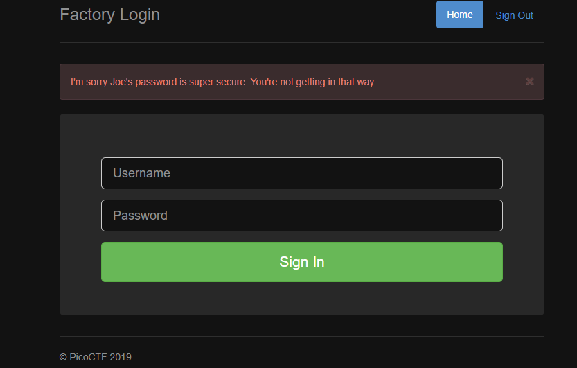
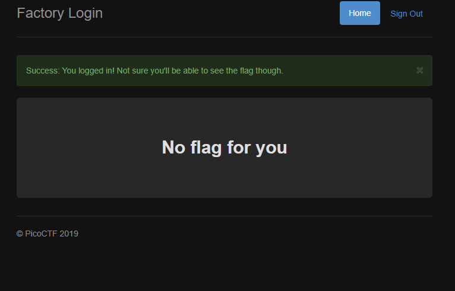
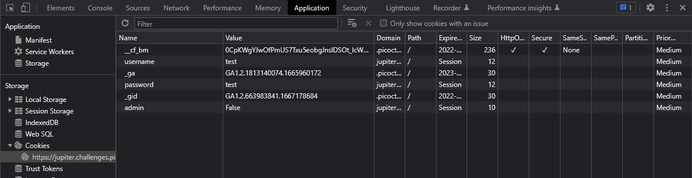
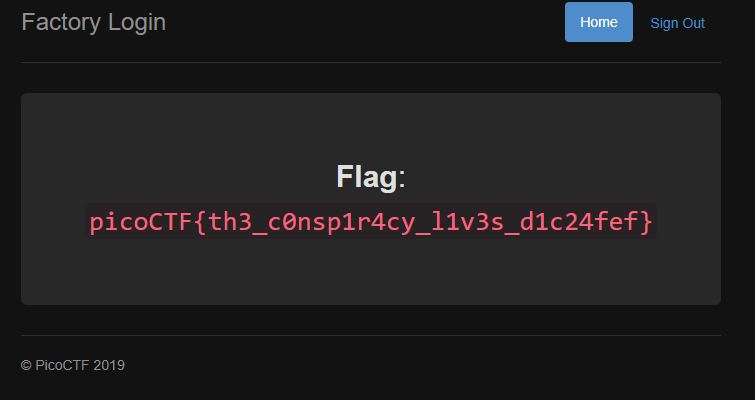

## Logon

## Description
The factory is hiding things from all of its users. Can you login as Joe and find what they've been looking at?  
[https://jupiter.challenges.picoctf.org/problem/13594/](https://jupiter.challenges.picoctf.org/problem/13594/)  

## Hints
Hmm it doesn't seem to check anyone's password, except for Joe's?

## How to
When we follow the link given we are prompted with a login screen, if we try to login as Joe, we get the below message
  
Given the hint, if we try to login as any other credentials, we can get in.  
  
If we analyze the source code, there are no leads, and given the hint,  
there might be a cookie, or something that is disabled that we would have if we logged in as Joe.  
If we view the cookies of the site, we can see our entered credentials and an `admin` cookie that is disabled.  
  
If we set this cookie to `True` and refresh the page, we will see the flag.

## Flag
`picoCTF{th3_c0nsp1r4cy_l1v3s_d1c24fef}`
